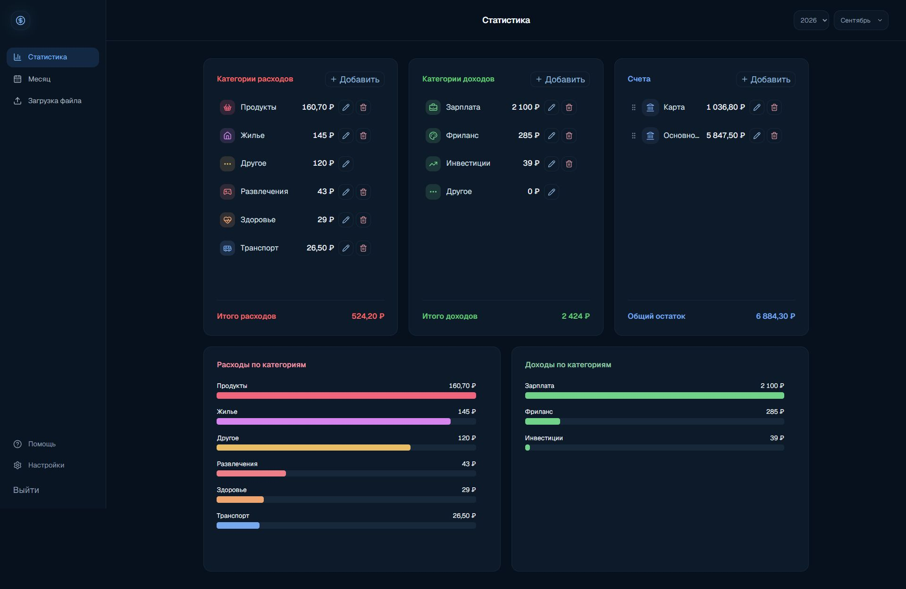

# Контроль бюджета

Веб-приложение для учёта личных доходов и расходов. Оно импортирует операции из Excel, позволяет исправлять их в месячном отчёте и показывает статистику по категориям за месяц или год. Данные и настройки пользователей изолированы друг от друга.



[Месячный отчёт на демонстрационных данных](docs/screenshots/month.png) · Скриншоты сделаны с отдельным тестовым аккаунтом, без пользовательских данных.

## Что умеет

- Импортировать `.xlsx` и `.xls`: проверять строки, исключать внутренние переводы и повторы, распределять операции по категориям.
- Сортировать и фильтровать операции по дате, сумме, категории, комментарию и счёту; редактировать их с автосохранением.
- Показывать расходы, доходы, остатки счетов и диаграммы за выбранный месяц или год.
- Управлять категориями, их иконками и цветами, а также счетами и порядком их отображения.
- Регистрировать пользователей с подтверждением email, менять и восстанавливать пароль; хранить данные каждого пользователя отдельно.
- Работать на телефоне: месячные операции отображаются карточками, фильтры и навигация адаптированы под узкий экран.

## Технологии и устройство

| Часть | Технологии |
| --- | --- |
| Интерфейс | React, TypeScript, Vinext, Tailwind CSS |
| API | Python, FastAPI, SQLAlchemy |
| Хранение | PostgreSQL, миграции Alembic |
| Проверки | unittest (39 тестов), Oxlint, TypeScript, сборка фронтенда |

Браузер обращается к FastAPI. API обрабатывает авторизацию, импорт и операции с данными, а запросы к интерфейсу проксирует локальному Node-серверу. Изоляция пользователей проверяется отдельными тестами, включая запросы к API от двух аккаунтов.

## Запуск локально

Понадобятся Python 3.12, Node.js 22.13+ и PostgreSQL. Создайте пустую базу `finance_dashboard`, затем скопируйте `.env.example` в `.env` и укажите в `DATABASE_URL` свои локальные реквизиты PostgreSQL. `.env` не отслеживается Git.

```sh
npm ci
python -m venv .venv
```

Активируйте виртуальное окружение: `source .venv/bin/activate` в Linux/macOS или `.\.venv\Scripts\Activate.ps1` в PowerShell. Затем выполните:

```sh
python -m pip install -r backend/requirements.txt
python -m alembic -c backend/alembic.ini upgrade head
python backend/run_local.py
```

Приложение откроется на `http://127.0.0.1:8001`. В режиме разработки FastAPI запускает фронтенд самостоятельно. Для первого локального пользователя без SMTP можно вызвать доступный **только в development** endpoint (в PowerShell используйте `curl.exe`):

```sh
curl -X POST http://127.0.0.1:8001/api/auth/setup \
  -H 'Content-Type: application/json' \
  -d '{"username":"demo","password":"dev-password-123"}'
```

После этого войдите как `demo`. Обычная регистрация по email требует настроенного SMTP; переменные для него перечислены в `.env.example`. Не используйте тестовый пароль и локальные реквизиты БД в продакшене.

## Проверки

```sh
npm run lint
npm run typecheck
npm run build:node
python -m unittest discover -s backend/tests
```

Те же проверки запускаются в [GitHub Actions](.github/workflows/ci.yml) при push и pull request. Готовые компоненты из `components/ui` исключены из lint, но участвуют в проверке типов и сборке.

## Развёртывание и безопасность

Пример конфигурации Linux VPS, PostgreSQL, systemd и HTTPS находится в [deploy/README.md](deploy/README.md). Секреты задаются только через `.env`; реальные финансовые данные, база и результаты сборки в репозиторий не добавляются. В продакшене требуется HTTPS и настроенная отправка писем.

Этот репозиторий содержит [исходный визуальный референс](reference.png), а не пользовательские финансовые данные. Демо-аккаунт с реальными данными намеренно не опубликован.
